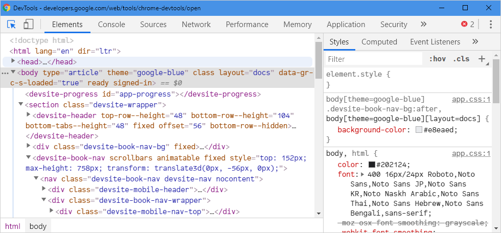

## Web Browsers

One important tool for JavaScript development (and, web development in general ) is the browser. You probably know enough about them, but if you don't, here are the top 5 web browsers best suited for developers. You can pick up any of these to start, you will end up dealing with the others, eventually. My personal choice, Firefox Developer Edition (most of the time), although I also use Chrome and Blisk a lot, and lately Microsoft Edge too.

1. [Firefox Developer Edition](https://www.mozilla.org/en-US/firefox/developer/). A web browser built for the open web. It offers you access to a next-generation CSS engine, an inactive CSS system that grays out CSS declarations that don’t impact the page, and more. You can also access a great JavaScript debugger, a Master CSS Grid, and various other features too.

2. [Google Chrome Dev](https://www.google.com/chrome/dev/). By far, the most used web browser. Created for the open web, Google Chrome for Developers helps developers to design websites that are specifically optimized for the next version of the digital world.

3. [Microsoft Edge](https://www.microsoft.com/en-us/edge). A good option since now it's based on Chromium (Google's open-source engine, same as Chrome). Make you sure you download and install it manually rather than upgrading through Windows Update.

4. [Opera](https://www.opera.com/). Sharing much of Chrome's DNA, Opera results in a similar user experience. A good browser.

5. [Safari for Developers](https://developer.apple.com/safari/). It might be hard to believe, but this is a very powerful tool – depending on what kind of websites and online experiences you want to build. In any case, it's the best way to ensure that your sites are going to perform good on Apple devices.

6. Others: 

    1. [Blisk](https://blisk.io/). An interesting alternative that is specifically designed to give designers a development-first workspace where they can develop and test modern applications as quickly as possible.

    2. [Brave](https://brave.com/). Arguably, the fastest browser around since it blocks all ads on all web pages by default. Unusual but good.

    3. [Vivaldi](https://vivaldi.com/). A truly unique browser that makes possible that no two Vivaldi users will have the same setup.

Most of the aforementioned browsers offer multiple editions (Beta, Developer, etc.), which include additional or early additions, features.

You can also make a quick Google search for more information about these browsers or any other as the options are way more than these.

## Browser Developer Tools

Developer tools are used for developing and debugging local and remote webpages. Today's browsers integrate built-in powerful developer tools, which helps us build better websites, faster. These tools enable us to do a myriad of things, like inspecting and editing DOM elements (from currently-loaded HTML, CSS, and JavaScript), executing (and debugging) JavaScript pieces of code, analyzing CSS performance, monitoring real-time network traffic as your website loads, simulating mobile device rendering, and much more.

### How to open the Developer Tools in your browser

Opening the Developer Tools in your web browser is a matter of a shortcut or a couple of steps. In any case, it's a simple task and browser-dependent. Here are three different ways to find the Developer Tools in the browser of your preference:

1. Keyboard Shortcut

    - Open the `Elements` panel
        - Windows/Linux: `Ctrl` + `Shift` +  `C`

        - macOS: `⌘` + `⌥` +  `C`  (`Cmd` + `Option` +  `C`)

    - Open the last panel you had open
        - Windows/Linux: `Ctrl` + `Shift` +  `I`

        - macOS: `⌘` + `⌥` +  `I`  (`Cmd` + `Option` +  `I`)

    - Open the `Console` panel (to view logged messages or run JavaScript)
        - Windows/Linux: `Ctrl` + `Shift` +  `J`

        - macOS: `⌘` + `⌥` +  `J`  (`Cmd` + `Option` +  `J`)

    - Internet Explorer: `F12`

    > If you’ve never used the Developer Tools in **Safari** before, you will need to enable them first. You can do this by going to `Safari > Preferences > Advanced`, and check the `Show Develop menu in menu bar` checkbox. Now when you right click, Inspect Element should appear.

You can find all keyboard shortcuts at [MDN](https://developer.mozilla.org/en-US/docs/Tools/Keyboard_shortcuts).

2. **Browser Main/Menu bar**
    - Chrome / Edge:
        - Select the browser's main menu (`Alt` + `F`), and then select `More Tools > Developer Tools`.

    - Firefox
        - Select the browser's main menu, and then select `Web Developer > Toggle Tools`.

    - Opera
        - Select the browser's main menu, and then select `Developer > Developer Tools`.

    - Safari
        - Select the browser's main menu, and then select `Develop > Show Web Inspector`.

3. **Context Menu**

    Press-and-hold/right-click an item on a webpage (Ctrl-click on the Mac), and choose **Inspect Element** from the context menu that appears. (An added bonus: this method straight-away highlights the code of the element you right-clicked.)

### Browser's Developer Tools Official Documentation Links

- [Google Chrome DevTools](https://developers.google.com/web/tools/chrome-devtools)

- [Firefox Developer Tools](https://developer.mozilla.org/en-US/docs/Tools)

- [Microsoft Edge DevTools](https://docs.microsoft.com/en-us/microsoft-edge/devtools-guide-chromium/open)

- [Safari Developer Tools](https://developer.apple.com/safari/tools/)

