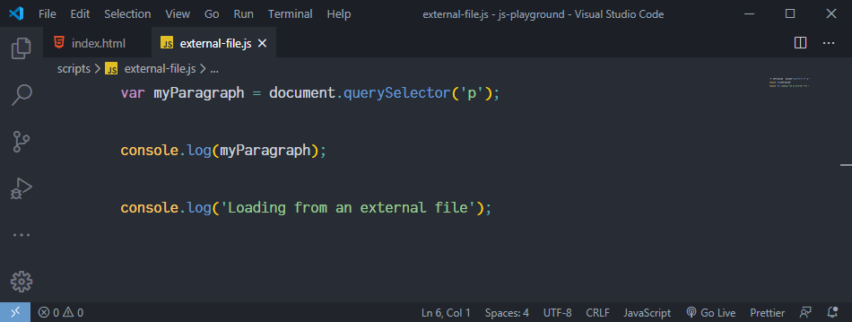

# 02. Running and Loading JavaScript

There are various ways to run JavaScript code. Let's take a look at each of them.

## Running JavaScript from the Console

The simplest way to run JavaScript code is through the **Developer Tools Console**. The Console is based on a **REPL** environment.

> A **read-eval-print loop (REPL)** is a simple, interactive computer programming environment that takes single user inputs (i.e., single expressions), evaluates (executes) them, and returns the result to the user; a program written in a REPL environment is executed piecewise.¹

So, in our context, the Console reads the JavaScript that you type into it, evaluates it, prints out the result, and then loops back to the first step.

Let's see this in action. First, open the `Console` panel on your browser Developer Tools, by typing `Ctrl + Shift + J` (Windows, Linux), or `⌘ + ⌥ + J` (`Command + Option + J`) (on macOS). Once the browser loads the DevTools Console, you can type in any JavaScript code, and it will run it for you. Just like that.


## Embedding JavaScript in HTML

You can insert JavaScript code into an HTML file by writing your code inside the `<script>` tag.

Although you can put the `<script>` tag on any part of an HTML document, it's usually placed right before the closing tag of the `<body>` element. By doing this, we ensure that the whole HTML document has loaded by the time the browser executes the `<script>` tag.

You may come across old code using the `<type>` attribute on the `<script>` tag, like so:

```html
<script type="text/javascript"></script>
```

This is not necessary anymore since HTML5 unless you're dealing with JavaScript modules.

### Example

We have JavaScript code added via the `<script>` tag on lines `10` through `13`. Once, we open this file on a browser, and inspect the Console, we'll see the variable `myParagraph` printed out, as a result of `console.log` on line `12`.


Snapshot of the `index.html` file with the `<script>` tag containing JavaScript code.


Snapshot of the page on the browser along with Developer Tools Console, and the result of the code from the `<script>` tag.

## Loading External JavaScript Files

The previous approach is convenient when dealing with small code snippets. As we start working with more code, it's better to write it in a separate file, and link that file to an HTML document, using the `<script>` tag. Loading JavaScript from a separate file implies that the browser will download it and cache it. This means less traffic, hence, faster pages.

For this, we add the `src` attribute to the `<script>` tag with a relative path to the JavaScript file as its value. Like so:

```html
<script src="./relativePathToJavaScriptFile.js"></script>
```

### Example

This time, we have JavaScript code written in a separate file, called `external-file.js`. In the `index.html` file, we pass a relative path to the JavaScript file as a value for the `src` attribute on the `<script>` tag. Once, we open this file on a browser, and inspect the Console, we'll see:
    
- the variable `myParagraph` printed out, as a result of `console.log` on line `3` of the `external-file.js` file, and

- the string `'Loading from an external file'` printed out, as a result of `console.log` on line `5` of the `external-file.js` file too.


Snapshot of the `index.html` file with the `<script>` tag referencing the `external-file.js` file.



Snapshot of the `external-file.js` file.


Snapshot of the page on the browser along with Developer Tools Console, and the result of the code from the `external-file.js` file.

🔮 When placing the `<script>` tag before any relevant part of the `<body>` element (for example, inside `<head>`), we'll need to use the `defer` or `async` directives to ensure it executes after the HTML content finishes loading.

It's worth knowing that a single script tag can't hold both the `src` attribute and code inside of it. Should this attribute be present, the code inside the `<script>` tag will be ignored.

## JavaScript Beyond the Browser

To execute JavaScript code via Node.js, you have to use the `node` globally available command and pass the name of the file you want to run.

So, if you named your JavaScript file `js-beyond-the-browser.js`, you can run it by typing:

```javascript
node js-beyond-the-browser.js
```

Make sure you are in the same directory which contains the `js-beyond-the-browser.js` file while running the command.


Snapshot of the `js-beyond-the-browser.js` file, and its execution via Node.js on the Terminal.

## Online Tools: Sandboxes and Playgrounds

A quick way of executing JavaScript code is by using the so-called Sandbox and Playground online services. These tools are a good option for running and sharing flash demos, issue reproductions, etc.

Here are a few ones you can try:

- [Playcode.io](https://playcode.io/)

- [JSBin](https://jsbin.com/)

- [JSFiddle](https://jsfiddle.net/)


### References

¹ *Read–eval–print loop*. Retrieved from [https://en.wikipedia.org/wiki/Read%E2%80%93eval%E2%80%93print_loop](https://en.wikipedia.org/wiki/Read%E2%80%93eval%E2%80%93print_loop)