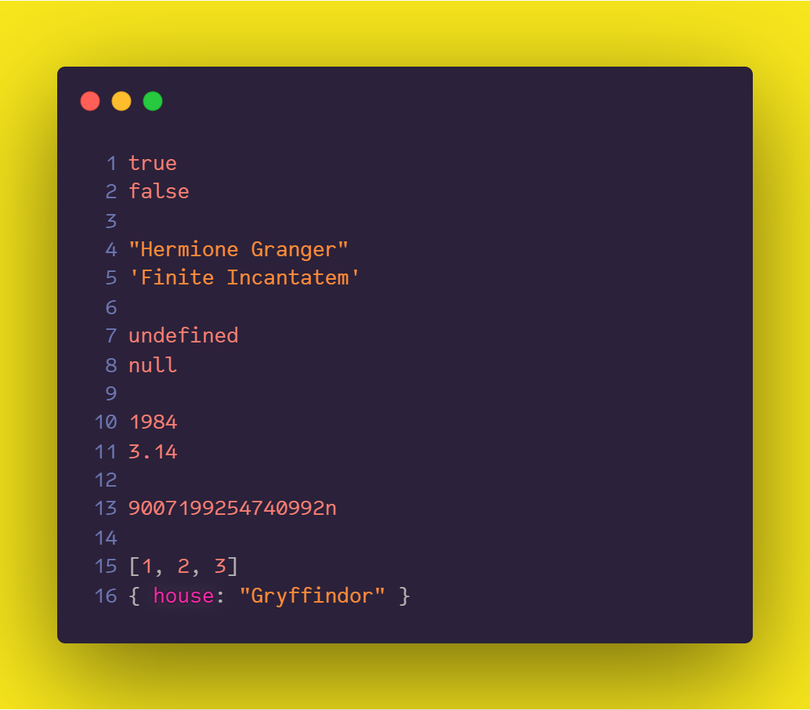
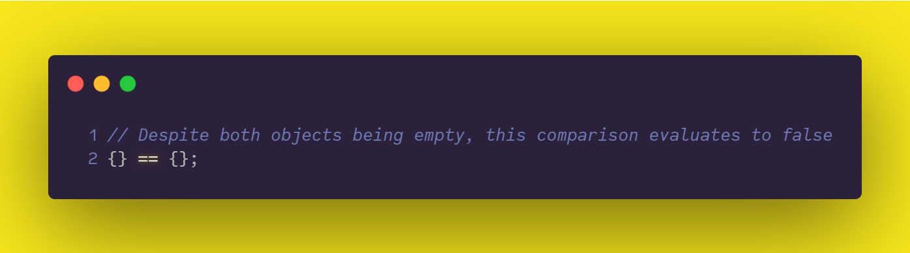
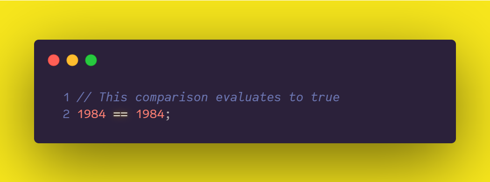
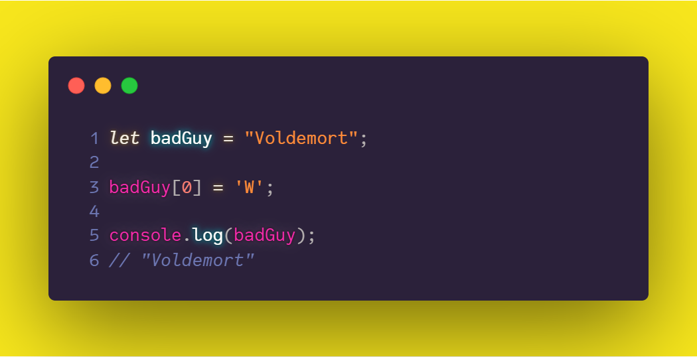

# 04. Values and Types

## Values 

We can define values as the basic building blocks, or the simplest components in JavaScript. Values allow us to represent concepts from the real world like *numbers* denoting math, and *strings* representing text. Each value has a **type** that determines its role.

## Types

Consider a **type** a set of data values. JavaScript distinguishes **eight data types**. With the notable exception of the `Object` type, all of them are said to be **primitive** types. Therefore, a value in JavaScript is always characterized by its type, which can be a primitive type or an `Object`.

- Primitive data types

  - `Boolean` – represents logic: **`true`** / **`false`**.

  - `String` – used to represent textual data.

  - `undefined` – used for *unintentionally* missing values.

  - `null` – used for *intentionally* missing values.

  - `Number` – representation of a number (integer or floating point).

  - `BigInt` (new) – an integer with an arbitrary precision (big numbers).

  - `Symbol` (new and infrequent) – unique identifier for objects (mainly used to hide implementation details).

- and `Object` – a data structure containing data and instructions for working with the data.¹

> You might be wondering whether I missed some data types here. What about `Array`, `Date`, `Function`? Well, all these data types are —technically— objects. But, **not everything is an object in JavaScript** (despite thousands of developers saying it over and over again). What we can assure, though, is that everything that is not a primitive, is indeed, an object in JavaScript.

Below, you can see an example of some JavaScript values with different data types.

- In lines 1 and 2, we have `Boolean` values.

- In lines 4 and 5, we can see `String` values.

- In lines 7 and 8, we  have `undefined` and `null` values, respectively.

- In lines 10 and 11, we have values of the `Number` type.

- In line 13, we can see a `BigInt` value.

- In lines 15 and 16, we have examples of `Object` values.

### Primitive values vs. Objects

We've seen that values in JavaScript may fall into two categories: *primitive values* and *objects*. One difference between the two is how we compare them; when it comes to objects, each of them is uniquely identical, meaning, that it only equals to itself (in a strict way).

Primitive values, on the other hand, are always considered the same when they represent an identical value.

**Mutability** is another important distinction between primitive values and objects. Whereas **objects are mutable** by default, **primitives are immutable**, i.e., read-only. The latter implies that we can't alter primitive values, we can't change them nor add/remove properties to/from them.

> Note that if we try to modify/set a property on a primitive value, JavaScript won't let us do so. The language may silently ignore our request, or throw an error (depending on if strict mode is enabled).

### References

¹*Object*. Retrieved from https://developer.mozilla.org/en-US/docs/Glossary/Object