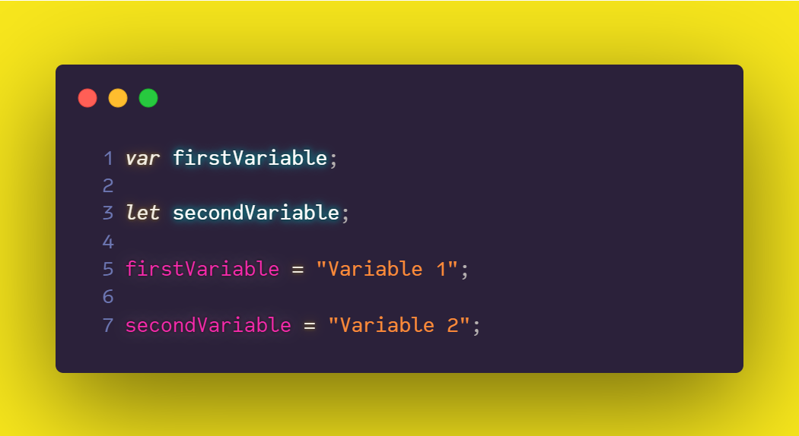

# 05. Variables

In JavaScript, a **variable**—which is, technically, referred to as an *identifier*—is a representation of some data stored in memory; this data can be of any type (which is why JavaScript variables are said to be loosely typed). In other words, JavaScript variables are named placeholders for values, pointers that we use—by assigning useful, recognizable names—to be able to access/retrieve values from memory.

## Variable Naming Convention

The names of JavaScript variables adhere to a fixed set of rules.

As for restrictions, we have that a JavaScript identifier

- must not start with a number,

- and it cannot be any of the [language reserved words](https://tc39.es/ecma262/#sec-keywords-and-reserved-words).

So, with the restrictions out of the way, a valid JavaScript variable name may start with (and include):

- a letter — given JavaScript case sensitivity, letters include the characters *A* through *Z* in both uppercase and lowercase variants. Furthermore, you can even use almost any Unicode character as an identifier, such as *ä* and *è*, although this is not a common thing to do.

- a dollar sign ($),

- or an underscore (_).
  
> Note that we can use digits (0–9) for subsequent characters.

Some examples of valid variables names are:

## Variable Declaration

In JavaScript, we declare variables before we use them. To declare a variable, you can use one of the three keywords —`var`, `let`, or `const`—, followed by the variable name, as follows:

From the image above, we can see that we can declare a variable without initializing it as we did on line 1. In this particular case, the `declaredWithVar` variable holds the value `undefined` since we did not assign any value to it.

### Variable Initialization

**Initializing** a variable means assigning a value to it as we did on lines 3 and 5, where we declared and initialized the `declaredWithLet` and `declaredWithConst` variables at the same time.

> Notice the use of the single equal (=) operator— technically called the *assignment operator*—which is used for assignment. We'll review operators in a later chapter.

A few key things to highlight:

- Initializing a variable to a value is **optional** when declaring the variable with `var` or `let`.

- Initializing a variable to a value is **mandatory** when declaring the variable with `const`. Otherwise, you will get an error.

- Declaring a variable with `const` results in a read-only, constant variable.

- Variables declared with either `let` or `const` are block-scoped, *local* variables.

- Depending on the *execution context*, `var` gives us the ability to declare both *local* and *global* variables.

So, we can declare variables with `var` or `let`, and initialize them later, like so:

Notice we didn't use the keywords when initializing the variables (on lines 5 and 7) as that is only necessary when declaring variables.

We can also declare multiple variables in one line. To achieve that, we have to separate the variable names by a comma, like so:

### Variable Re-assigment

Just like one can initialize a variable after having declared it, it is also possible to re-assign a value to it. Again, we don't have to use the keywords as that is only necessary when declaring variables.

Here, we re-assign the `areGlassesBroken` variable in line 5.

> It is only possible to re-assign variables declared with `var` or `let`. Re-assignment for variables declared with `const` is not allowed, and an attmept to do so will result in a syntax error.

### Referencing a Variable

Referencing a variable means getting access to the value that variable holds at a given time. To access a variable, just use its name:

In line 3, we reference the `wizardName` variable, which outputs its value: the string `"Harry Potter"`.

### Undefined vs Undeclared variables

We mentioned earlier that if we declare a variable without initializing it, this variable will hold the value of `undefined`, i.e., we might refer to it as an *undefined variable*.

We also mention that, in JavaScript, we declare variables before we use them. So, an attempt to initialize or reference a variable that has not been declared will result in a syntax error. Such a variable will be called an *undeclared variable*.

So be aware of the distinction between these two concepts: an undefined variable is a variable that has been declared, but it doesn't have a value, whereas an undeclared variable is a variable that has never been declared.

Here, accessing the `wizardSchool` variable, in line 3, yields the value `undefined`. Whereas, —in line 6— attempting to access the `wizardTown` variable (which hasn't been declared) leads to an error.

### Constants

As we said before, JavaScript **constant** variables (variables declared with `const`) are initialized when declared, i.e., these variables must be assigned a value when they are declared.

Let's try to understand a bit more the minutiae of JavaScript constant variables.

First things first, what is a constant?

> "In computer programming, a **constant** is a value that cannot be altered by the program during normal execution, i.e., the value is *constant*."¹

However, this is not quite the case in JavaScript since constant variables are not *constant* in the purest sense. The `const` keyword is misleading as it does not declare a constant variable but rather a *constant reference* to a value.

As a result, we cannot change constant variables holding primitive values, but we can change the properties of objects stored in constant variables.

Let's look at an example:

Here, on line 1, we declared the `deathlyHallows` variable, which holds the value `3`, a primitive, therefore, immutable value. Then, on line 3, we declared the `wizard` variable, which holds an object.

Later, on line 9, we attempted to re-assign the `deathlyHallows` variable. Since this variable holds a primitive value, such an attempt results in a *TypeError*. The same thing happened when we tried to re-assign the `wizard` variable on line 12.

However, notice that on line 15, we were able to modify the `name` property of the `wizard` object, despite the latter being stored on a constant variable. This proves what we said before: *we cannot change constant variables holding primitive values, but we can change the properties of objects stored in constant variables.*

## Variable Scope

In JavaScript, all variables live inside of a scope that delimits their existence, and which part of the program can reach (or access) them. But, what is a scope?

> "In computer programming, the scope of a name binding—an association of a name to an entity, such as a **variable**—is the region of a computer program where the binding is valid: where the name can be used to refer to the entity."²

In other words, a scope is a code section where the program (or the JavaScript engine) will look for variables, so we can know where a given identifier comes from.

### Global and local variables

> We're getting a bit ahead of ourselves here as we'll be using *functions*, and *statements* for more useful examples. Later, we'll be deeply reviewing each of these topics on their own chapters.

In JavaScript, there are three types of scope:

- The **global scope** is the outermost scope, outside any function. Any variable declared outside of a function is added to the global scope; therefore, it becomes reachable and accessible for the rest of your program.

- The **local scope** (or **function scope**) is a scope that exists within a function, so if you declare a variable inside of a function, JavaScript adds that variable to the function scope, and it will be reachable only from inside of the function.

- The **block scope** is limited to *block statements* and *expressions*. A JavaScript block is surrounded by a couple of curly brackets. Some examples can be `if`, `for`, and `while` statements. All these statements define a new block scope.

Let's take a look at a few examples to illustrate these concepts.

- Declaring and accessing **global** variables:
  
  

  On this example, we declared three global variables: `globalVariable`, `globalLetVariable`, and `globalConstVariable`. Then—on lines 7, 10, and 13—we could access those variables, as expected.

- Declaring and accessing **local/function** variables:
  
  

  On this example, we declared three local variables inside the `myFunction` function: `localVariable`, `localLetVariable`, and `localConstVariable`. Then—on lines 13, 16, and 19—we could access those variables, from inside the function, as expected. However, when we attempted to do the same thing from outside the function—on lines 30, 33, and 36—we got an error since those variable are local-scoped to the function, so they're only accessible from inside the function itself.

- Declaring and accessing **block-scoped** variables:
  
  

  On this last example, we attempted to create three block-scoped variables inside the `if` statement: `blockVariable`, `blockLetVariable`, and `blockConstVariable`. Then—on lines 11, 14, and 17—we tried to access those variables from outside the block statement, which yielded different results. When referencing block-scoped variables declared with `let` or `const`, JavaScript throws an error; however, for the variable declared with `var`, we could get its value. This shows that by using `let` and `const`, we have more control over code, which is why—nowadays—many JavaScript developers prefer `let` and `const` over `var`.

### Using `var` in strict mode

For historical reasons, it is possible to declare a variable without using any keyword. However, this is not recommended, and you should avoid doing it.

Such a *declaration* leads to the creation of a global variable.

Notice that this won't work in strict mode. In that case, JavaScript will throw an error.

### Capitalization Style: camelCase

When it comes to naming variables with multiple words, there's a common practice in JavaScript (and, in computer programming in general). JS developers use [camelCase](https://en.wikipedia.org/wiki/Camel_case) for that. It works like this: all words are written one after the other with no spaces; each word, except for the first one, begins with a capital letter.

As an example, we have:

To be more specific, that style is known as *Dromedary camelCase*; there is also *Pascal camelCase*, which only differs in having all words starting with a capital letter. The latter is commonly used to declare Classes or Components.

There are many other capitalization styles, such as *Snake Case*, which uses underscores to separate words, also *Kebab-Case*—which is not allowed in JavaScript—but, is typically used in HTML for classes; however, camelCase is almost the de-facto style in JavaScript.

### Meaningful Variable Names

So, now we know how to declare and initialize variables, how to re-assign them, and much more. But, it is important to know how to name variables, in a semantic, meaningful way. Since identifiers are meant to be a representation of our programs' stored data, they should act like *nouns*, providing—at a glimpse—self-explanatory information about the data it stores.

## Summary

We can declare variables for data storing in three different ways: by using the `var`, `let`, or `const` keywords.

- `var` — older declaration keyword. Along with `let`, makes initialization optional. It also allows us to declare both *local* and *global* variables.

- `let` — modern declaration keyword. Along with `const`, declares a block-scoped, *local* variable.

- `const` — declares a read-only, *constant* variable. Must be initialized when declared.

We also have that:

- Initializing a variable to a value is **optional** when declaring the variable with `var` or `let`.

- Initializing a variable to a value is **mandatory** when declaring the variable with `const`. Otherwise, you will get an error.

- Declaring a variable with `const` results in a read-only, constant variable.

- Variables declared with either `let` or `const` are block-scoped, *local* variables.

- Depending on the *execution context*, `var` gives us the ability to declare both *local* and *global* variables.

As for naming variables, a good identifier name should provide enough information to easily understand the role of the data it holds.

### References

¹*Constant (computer programming)*. Retrieved from https://en.wikipedia.org/wiki/Constant_(computer_programming)

²*Scope (computer science)*. Retrieved from https://en.wikipedia.org/wiki/Scope_(computer_science)
